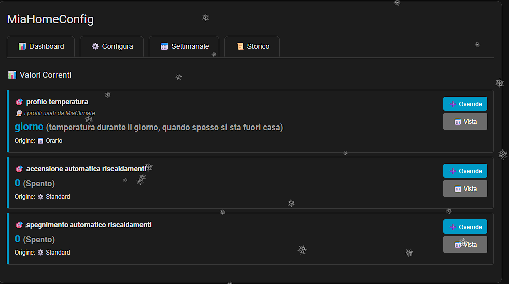
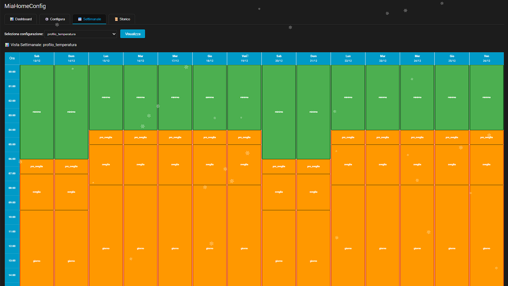
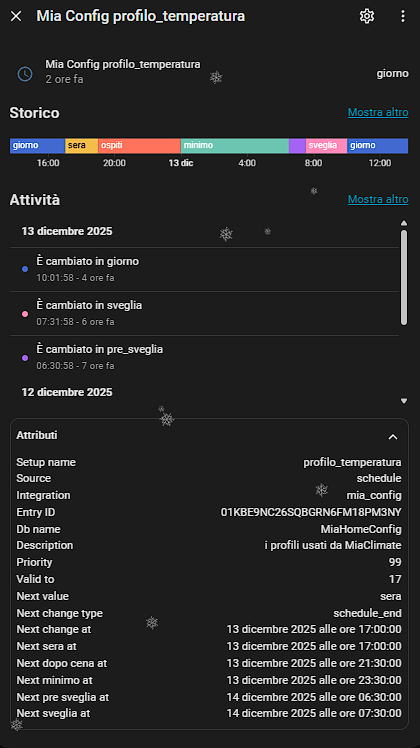

# Mia Config per Home Assistant

[](https://github.com/hacs/integration)
[](https://GitHub.com/abiale85/MiaConfig/releases/)
[](https://GitHub.com/abiale85/MiaConfig/issues/)
[](https://github.com/abiale85/MiaConfig/blob/main/LICENSE)

Un componente custom per Home Assistant che gestisce configurazioni dinamiche con valori che cambiano automaticamente in base a regole temporali e orarie con sistema avanzato di priorità.

## Caratteristiche

- **Multi-Istanza**: Supporto per configurazioni separate per più case/ambienti
- **Configurazioni Standard**: Valori di default con sistema di priorità personalizzabile
- **Configurazioni a Tempo**: Valori validi in intervalli di date specifici con priorità
- **Configurazioni a Orario**: Valori validi in fasce orarie giornaliere con selezione giorni settimana e priorità
- **Sistema Priorità Avanzato**: Ogni configurazione ha priorità numerica (1 = massima, 99 = minima)
- **Sensori Dinamici**: Ogni configurazione viene esposta come sensore in Home Assistant
- **Predizione Eventi**: Attributi con timestamp ISO dei prossimi cambiamenti valore
- **Servizi Completi**: API per gestire le configurazioni tramite automazioni o script
- **Interfaccia UI Completa**: Card Lovelace con dashboard, vista settimanale, gestione e storico
- **Database Isolato**: Ogni istanza ha il proprio database SQLite separato
- **Storico Completo**: Cronologia modifiche con paginazione e ripristino

## Installazione

### Metodo 1: Installazione Manuale

1. Copia la cartella `custom_components/mia_config` nella cartella `custom_components` della tua configurazione Home Assistant
   - **Nota**: La cartella include già i file necessari nella sottocartella `www/`
2. Riavvia Home Assistant

### Metodo 2: HACS (Consigliato)

1. Apri HACS
2. Vai su "Integrazioni"
3. Clicca sui tre puntini in alto a destra → "Repository personalizzati"
4. Aggiungi: `https://github.com/abiale85/MiaConfig` (Categoria: Integration)
5. Cerca "Mia Config"
6. Clicca su "Installa"
5. Riavvia Home Assistant

## Configurazione

### Aggiunta tramite UI (Consigliato)

1. Vai su **Impostazioni** → **Dispositivi e Servizi**
2. Clicca su **Aggiungi Integrazione**
3. Cerca **Mia Config**
4. Inserisci un nome per il database (es. "MiaHomeConfig" per casa principale)
5. Conferma

**Multi-Istanza**: Puoi aggiungere l'integrazione più volte con nomi diversi per gestire configurazioni separate (es. casa principale, casa vacanze, ufficio).

Ogni istanza:
- Ha un database SQLite dedicato (`<db_name>.db`)
- Crea un sensore principale per monitorare lo stato
- È completamente isolata dalle altre istanze

## Interfaccia UI

### Installazione Card Lovelace

1. **Registra la risorsa**: Vai su **Impostazioni** → **Dashboard** → **Risorse** e aggiungi:
   - URL: `/mia_config_local/mia-config-card.js`
   - Tipo: `JavaScript Module`
   - **Nota**: Il percorso `/mia_config_local/` viene servito automaticamente dalla cartella `custom_components/mia_config/www/`

2. **Aggiungi la card** al tuo dashboard:
```yaml
type: custom:mia-config-card
entity_id: sensor.miahomeconfig_main  # Opzionale: specifica l'istanza da gestire
```

**Nota**: Se hai più istanze e non specifichi `entity_id`, la card mostrerà la prima istanza trovata.

La card ti permette di:
- ✅ **Dashboard**: Visualizza valori correnti e configurazioni attive
- ✅ **Configura**: Crea/modifica configurazioni Standard, a Orario e a Tempo + gestione valori validi
- ✅ **Vista Settimanale**: Barre colorate che mostrano i valori per ogni ora della settimana
- ✅ **Storico**: Cronologia modifiche con paginazione (20 elementi per pagina) e ripristino
- ✅ **Mobile-Responsive**: Ottimizzata per smartphone e tablet con layout adattivi

**Header Card**: Il titolo della card mostra automaticamente il nome dell'istanza (es. "MiaHomeConfig")

**Valori Validi**: Nel tab Configura puoi definire opzionalmente valori consentiti per ogni configurazione:
- Esempio: `riscaldamento` → "0"="Off", "1"="Economy", "2"="Comfort"
- Sezione dedicata "✓ Valori Validi" in fondo al tab Configura
- Eliminazione automatica quando la configurazione viene cancellata
- Se non definiti, qualsiasi valore è accettato

Per maggiori dettagli vedi [UI_GUIDE.md](UI_GUIDE.md)

## Utilizzo

## Esempi di Snapshot

Di seguito alcuni esempi dell'interfaccia di MiaHomeConfig:


### Dashboard e Valori Correnti

La schermata principale mostra i valori correnti delle configurazioni, con la possibilità di effettuare override o visualizzare i dettagli.

### Vista Settimanale

La vista settimanale permette di visualizzare e modificare i profili orari delle configurazioni, con una chiara rappresentazione grafica delle fasce orarie e dei giorni della settimana.

**Come funziona ora**: la card delega tutto il calcolo al backend tramite il servizio `mia_config.simulate_schedule`, che restituisce i segmenti già risolti con le priorità applicate. Gli override condizionali vengono valutati minuto per minuto in base al valore che il setup di riferimento avrà in quel momento simulato (non sul valore corrente), così l’override appare solo quando la condizione è effettivamente vera.

### Storico e Dettaglio Configurazione

La schermata di dettaglio mostra lo storico dei cambiamenti di stato e i prossimi cambi previsti, con tutti gli attributi della configurazione selezionata.

### Database

Ogni istanza crea automaticamente un database SQLite separato (`<nome_istanza>.db`) con le seguenti tabelle:

- **configurazioni**: Configurazioni standard con priorità
- **configurazioni_a_orario**: Configurazioni valide in fasce orarie giornaliere
- **configurazioni_a_tempo**: Configurazioni valide in intervalli di date
- **configurazioni_valori_validi**: Valori opzionali consentiti con descrizioni
- **configurazioni_storico**: Cronologia modifiche con operazioni INSERT/UPDATE/DELETE

### Logica di Priorità

Quando più configurazioni esistono per lo stesso nome, il valore attivo viene determinato da:

1. **Tipo di configurazione** (source_order):
   - Time (configurazioni a tempo): source_order = 1
   - Schedule (configurazioni a orario): source_order = 2
   - Standard (configurazioni base): source_order = 3

2. **Priorità numerica** (per configurazioni dello stesso tipo):
   - Valori: 1 (massima priorità) - 99 (minima priorità)
   - Default: 99 se non specificato
   - Una schedule con priorità 50 batte una schedule con priorità 99

**Esempio**: Se alle 08:00 sono attive:
- Schedule "sveglia" (priorità 99) dalle 05:30-08:15
- Schedule "colazione" (priorità 100) dalle 07:00-08:00

Viene applicata "sveglia" perché ha priorità migliore (99 < 100)

### Sensori

Ogni configurazione viene automaticamente esposta come sensore:

- **Entity ID**: `sensor.<db_name>_<setup_name>`
- **Valore**: Il valore corrente secondo la priorità
- **Attributi**:
  - `setup_name`: Nome della configurazione
  - `source`: Tipo di configurazione attiva (`time`, `schedule`, `standard`)
  - `priority`: Priorità numerica della configurazione attiva
  - `next_value`: Prossimo valore che sarà attivo
  - `next_change_at`: Timestamp ISO del prossimo cambio (es. `2025-12-02T14:30:00`)
  - `next_change_type`: Tipo del prossimo cambio (`schedule`, `schedule_end`, `time`, `time_end`)
  - `next_<valore>_at`: Timestamp della prima occorrenza di ogni valore specifico

**Utilizzo in automazioni**:
```yaml
trigger:
  - platform: template
    value_template: >
      
      {{ (as_datetime(next_at) - now()).total_seconds() / 60 < 30 }}
```

### Servizi

#### `mia_config.set_config`

Imposta una configurazione standard.

```yaml
service: mia_config.set_config
data:
  setup_name: "temperatura_target"
  setup_value: "22"
  priority: 99  # Opzionale, default: 99 (bassa)
  description: "Temperatura default"  # Opzionale
  entity_id: sensor.miahomeconfig_main  # Opzionale, per specificare l'istanza
```

#### `mia_config.set_time_config`

Imposta una configurazione valida in un intervallo di date.

```yaml
service: mia_config.set_time_config
data:
  setup_name: "temperatura_target"
  setup_value: "18"
  valid_from_date: "2025-12-01 00:00:00"
  valid_to_date: "2025-12-31 23:59:59"
  priority: 50  # Opzionale, default: 99
  description: "Vacanze invernali"  # Opzionale
  entity_id: sensor.miahomeconfig_main  # Opzionale
```

#### `mia_config.set_schedule_config`

Imposta una configurazione valida in una fascia oraria giornaliera.

```yaml
service: mia_config.set_schedule_config
data:
  setup_name: "temperatura_target"
  setup_value: "20"
  valid_from_ora: 8.5  # 08:30 in formato decimale (8 + 30/60)
  valid_to_ora: 18.0   # 18:00 in formato decimale
  days_of_week: [0, 1, 2, 3, 4]  # Lun-Ven (array di numeri)
  priority: 80  # Opzionale, default: 99
  description: "Orario lavorativo"  # Opzionale
  entity_id: sensor.miahomeconfig_main  # Opzionale
```

**Nota Formato Orario**: 
- L'orario va specificato in **formato decimale**: ore + (minuti/60)
  - Esempi: `8.5` = 08:30, `14.25` = 14:15, `23.983333` = 23:59
- Ore valide: 0-23, Minuti validi: 0-59
- **Override 24 ore**: Se `valid_from_ora` = `valid_to_ora`, la configurazione è attiva 24 ore
  - Esempi: `0.0` - `0.0` = 24h, `22.0` - `22.0` = 24h, `8.5` - `8.5` = 24h
- I giorni: 0=Lunedì, 1=Martedì, 2=Mercoledì, 3=Giovedì, 4=Venerdì, 5=Sabato, 6=Domenica
- Se ometti `days_of_week`, la configurazione sarà valida tutti i giorni
- **Attraversa mezzanotte**: Se `valid_to_ora` < `valid_from_ora` (es. 22:00 - 06:00), la fascia attraversa la mezzanotte

#### `mia_config.set_conditional_config`

Imposta una configurazione condizionale che si attiva solo quando un'altra configurazione ha un valore specifico.

```yaml
service: mia_config.set_conditional_config
data:
  setup_name: "accensione_automatica_riscaldamenti"
  setup_value: "0"
  conditional_config: "profilo_temperatura"  # Configurazione da monitorare
  conditional_operator: "=="  # Operatore: ==, !=, >, <, >=, <=, contains, not_contains
  conditional_value: "minimo"  # Valore atteso
  priority: 50  # Opzionale, default: 99
  valid_from_ora: 5.5  # Opzionale: filtro orario inizio (05:30)
  valid_to_ora: 8.25   # Opzionale: filtro orario fine (08:15)
  entity_id: sensor.miahomeconfig_main  # Opzionale
```

**Configurazioni Condizionali Avanzate**:
- **Dipendenze a catena**: Supporto completo per condizionali che dipendono da altri condizionali
  - Esempio: `tipo_sveglia` = "sveglia6" → `profilo_temperatura` = "sveglia" → `accensione_automatica` = "1"
- **Valutazione iterativa**: Il sistema risolve automaticamente le dipendenze fino a convergenza (max 10 iterazioni)
- **Filtro orario opzionale**: Puoi limitare il condizionale a una fascia oraria specifica
  - Se omesso, il condizionale è attivo 24h quando la condizione è soddisfatta
  - Se specificato, il condizionale è attivo solo nella fascia oraria E quando la condizione è vera
- **Source order**: I condizionali hanno source_order = 0 (massima priorità tra i tipi)

**Operatori disponibili**:
- `==`: Uguale (es. temperatura = "22")
- `!=`: Diverso (es. modalità != "vacanza")
- `>`, `<`, `>=`, `<=`: Confronti numerici (es. temperatura > "20")
- `contains`: Contiene sottostringa (es. stato contains "attivo")
- `not_contains`: Non contiene (es. stato not_contains "errore")

#### `mia_config.delete_single_config`

Elimina una singola configurazione specifica.

```yaml
service: mia_config.delete_single_config
data:
  config_id: 15  # ID della configurazione da eliminare
  config_type: "schedule"  # Tipo: standard, time, schedule
  entity_id: sensor.miahomeconfig_main  # Opzionale
```

#### `mia_config.get_configurations`

Recupera le configurazioni esistenti (restituisce una risposta).

```yaml
service: mia_config.get_configurations
data:
  setup_name: "temperatura_target"  # Opzionale, ometti per tutte
  entity_id: sensor.miahomeconfig_main  # Opzionale
response_variable: configs
```

#### `mia_config.get_history`

Recupera lo storico delle modifiche alle configurazioni con paginazione.

```yaml
service: mia_config.get_history
data:
  setup_name: "temperatura_target"  # Opzionale, ometti per tutte
  limit: 20  # Elementi per pagina, default: 50
  offset: 0  # Offset per paginazione, default: 0
  entity_id: sensor.miahomeconfig_main  # Opzionale
response_variable: history_data
```

**Risposta**:
```yaml
history: 
  - id: 123
    timestamp: "2025-12-02 10:30:00"
    setup_name: "temperatura_target"
    config_type: "schedule"
    setup_value: "22"
    operation: "INSERT"
    # ... altri campi
total: 150  # Numero totale record (per paginazione)
```

#### `mia_config.cleanup_history`

Pulisce la cronologia eventi vecchi dal database.

```yaml
service: mia_config.cleanup_history
data:
  days: 30  # Elimina eventi più vecchi di 30 giorni
  entity_id: sensor.miahomeconfig_main  # Opzionale
```

#### `mia_config.add_valid_value`

Aggiunge un valore valido con descrizione per una configurazione (opzionale).

```yaml
service: mia_config.add_valid_value
data:
  setup_name: "riscaldamento"
  value: "0"
  description: "Spento"  # Opzionale
  sort_order: 0  # Opzionale, default: 0
  entity_id: sensor.miahomeconfig_main  # Opzionale
```

**Valori validi**: Se definiti, puoi creare un sistema di validazione per i valori delle configurazioni. Per esempio:
- `riscaldamento`: "0"="Off", "1"="Economy", "2"="Comfort"
- `allarme`: "armed_away"="Totale", "armed_home"="Casa", "disarmed"="Disattivato"

I valori validi sono opzionali e indipendenti dalle configurazioni. Se non definiti, qualsiasi valore è accettato.

#### `mia_config.delete_valid_value`

Elimina un valore valido.

```yaml
service: mia_config.delete_valid_value
data:
  id: 5  # ID del valore valido da eliminare
  entity_id: sensor.miahomeconfig_main  # Opzionale
```

#### `mia_config.get_valid_values`

Ottiene i valori validi per una configurazione (supporta response).

```yaml
service: mia_config.get_valid_values
data:
  setup_name: "riscaldamento"  # Opzionale, se omesso restituisce tutti
  entity_id: sensor.miahomeconfig_main  # Opzionale
response_variable: valid_values
```

## Esempi di Utilizzo

### Esempio 1: Temperatura Climatizzatore

Imposta una temperatura di default, più bassa di notte e ancora più bassa durante le vacanze:

```yaml
# Temperatura standard
service: dynamic_config.set_config
data:
  setup_name: "temperatura_clima"
  setup_value: "22"

# Temperatura notturna (ogni notte dalle 22:00 alle 06:00)
service: dynamic_config.set_schedule_config
data:
  setup_name: "temperatura_clima"
  setup_value: "19"
  valid_from_ora: 22.00
  valid_to_ora: 6.00

# Temperatura vacanze invernali (dal 20/12 al 10/01)
service: dynamic_config.set_time_config
data:
  setup_name: "temperatura_clima"
  setup_value: "16"
  valid_from: "2025-12-20 00:00:00"
  valid_to: "2026-01-10 23:59:59"
```

### Esempio 2: Utilizzo in Automazione

```yaml
automation:
  - alias: "Regola Temperatura da Configurazione"
    trigger:
      - platform: state
        entity_id: sensor.dynamic_config_temperatura_clima
    action:
      - service: climate.set_temperature
        target:
          entity_id: climate.condizionatore
        data:
          temperature: "{{ states('sensor.dynamic_config_temperatura_clima') | float }}"
```

### Esempio 3: Brightness Luci per Fasce Orarie con Giorni Specifici

```yaml
# Luminosità normale
service: dynamic_config.set_config
data:
  setup_name: "brightness_soggiorno"
  setup_value: "100"

# Luminosità ridotta sera nei giorni feriali (19:00 - 22:00, Lun-Ven)
service: dynamic_config.set_schedule_config
data:
  setup_name: "brightness_soggiorno"
  setup_value: "60"
  valid_from_ora: 19.00
  valid_to_ora: 22.00
  days_of_week: ["0", "1", "2", "3", "4"]  # Lun-Ven

# Luminosità ridotta tutto il giorno nel weekend
service: dynamic_config.set_schedule_config
data:
  setup_name: "brightness_soggiorno"
  setup_value: "70"
  valid_from_ora: 0.00
  valid_to_ora: 23.59
  days_of_week: ["5", "6"]  # Sab-Dom

# Luminosità minima notte (22:00 - 07:00, tutti i giorni)
service: dynamic_config.set_schedule_config
data:
  setup_name: "brightness_soggiorno"
  setup_value: "20"
  valid_from_ora: 22.00
  valid_to_ora: 7.00
```

### Esempio 4: Visualizzazione in Lovelace

```yaml
type: entities
title: Configurazioni Dinamiche
entities:
  - entity: sensor.dynamic_config_temperatura_clima
    name: Temperatura Target
    icon: mdi:thermometer
  - entity: sensor.dynamic_config_brightness_soggiorno
    name: Luminosità Soggiorno
    icon: mdi:brightness-6
```

## Struttura Database


## Struttura Database (aggiornata)

### Tabella `configurazioni`
```sql
CREATE TABLE IF NOT EXISTS configurazioni (
  id INTEGER PRIMARY KEY AUTOINCREMENT,
  setup_name TEXT NOT NULL,
  setup_value TEXT,
  priority INTEGER NOT NULL DEFAULT 99
)
```

### Tabella `configurazioni_a_orario`
```sql
CREATE TABLE IF NOT EXISTS configurazioni_a_orario (
  id INTEGER PRIMARY KEY AUTOINCREMENT,
  setup_name TEXT NOT NULL,
  setup_value TEXT,
  valid_from_ora REAL NOT NULL,  -- orario in decimale base 60 (es: 22.5 = 22:30)
  valid_to_ora REAL,
  days_of_week TEXT DEFAULT '0,1,2,3,4,5,6', -- giorni abilitati (0=Lun, 6=Dom)
  priority INTEGER NOT NULL DEFAULT 99
)
```

### Tabella `configurazioni_a_tempo`
```sql
CREATE TABLE IF NOT EXISTS configurazioni_a_tempo (
  id INTEGER PRIMARY KEY AUTOINCREMENT,
  setup_name TEXT NOT NULL,
  setup_value TEXT,
  valid_from_date DATETIME NOT NULL,
  valid_to_date DATETIME,
  valid_from_ora REAL,  -- opzionale: orario di inizio (decimale base 60)
  valid_to_ora REAL,    -- opzionale: orario di fine (decimale base 60)
  days_of_week TEXT,    -- opzionale: giorni abilitati
  priority INTEGER NOT NULL DEFAULT 99
)
```

### Tabella `configurazioni_storico`
```sql
CREATE TABLE IF NOT EXISTS configurazioni_storico (
  id INTEGER PRIMARY KEY AUTOINCREMENT,
  setup_name TEXT NOT NULL,
  config_type TEXT NOT NULL,
  setup_value TEXT,
  priority INTEGER,
  valid_from_ora REAL,
  valid_to_ora REAL,
  days_of_week TEXT,
  valid_from_date TEXT,
  valid_to_date TEXT,
  operation TEXT NOT NULL,
  timestamp TEXT NOT NULL DEFAULT CURRENT_TIMESTAMP
)
```

### Tabella `configurazioni_descrizioni`
```sql
CREATE TABLE IF NOT EXISTS configurazioni_descrizioni (
  setup_name TEXT PRIMARY KEY NOT NULL,
  description TEXT
)
```

### Tabella `configurazioni_valori_validi`
```sql
CREATE TABLE IF NOT EXISTS configurazioni_valori_validi (
  id INTEGER PRIMARY KEY AUTOINCREMENT,
  setup_name TEXT NOT NULL,
  value TEXT NOT NULL,
  description TEXT,
  sort_order INTEGER DEFAULT 0,
  UNIQUE(setup_name, value)
)
```

## 🔧 Note Importanti e Fix Recenti

### v1.5.5 (Gennaio 2026) - Fix Critici

#### ✅ Override Orari 24 Ore
**Problema Risolto**: Gli override orari con stesso orario di inizio e fine ora funzionano correttamente come configurazioni attive 24 ore.

**Esempi funzionanti**:
- `00:00 - 00:00` → Attivo 24 ore
- `08:00 - 08:00` → Attivo 24 ore  
- `22:00 - 22:00` → Attivo 24 ore

**Come funziona**: Se `valid_from_ora == valid_to_ora`, il sistema interpreta come "sempre attivo" per quei giorni.

#### ✅ Validazione Formato Tempo Corretta
**Problema Risolto**: Errore "minuti devono essere tra 0 e 59, ricevuto: 98" quando si inseriva 23:59.

**Causa**: La validazione usava formula errata (moltiplicava per 100 invece di 60).

**Fix**: Ora la conversione decimale → minuti è corretta:
- `23.983333` → `round(0.983333 * 60)` = 59 minuti ✅

#### ✅ Configurazioni Condizionali Dipendenti
**Problema Risolto**: I condizionali che dipendono da altri condizionali ora usano i valori corretti.

**Esempio scenario risolto**:
1. Condizionale A: `tipo_sveglia = sveglia6` → `profilo_temperatura = sveglia`
2. Condizionale B: `profilo_temperatura = minimo` → `accensione_automatica = 0`

**Prima**: Il Condizionale B vedeva sempre il valore "minimo" (standard), anche quando A lo cambiava in "sveglia"  
**Ora**: Il Condizionale B vede "sveglia" quando A è attivo, quindi non si applica ✅

**Implementazione**: Valutazione iterativa fino a convergenza (max 10 iterazioni).

### Vista Settimanale - Miglioramenti UI

#### Tooltip Intelligente
- **Barre 24h**: Tooltip sempre visualizzato sopra per evitare di andare fuori schermo
- **Barre inizio giornata** (0-3h): Tooltip sotto per evitare taglio in alto
- **Altre barre**: Logica automatica basata su spazio disponibile nel viewport

#### Hover Pulito
- Rimosso effetto di espansione laterale della banda all'hover
- Mantenuto solo l'ombra per feedback visivo
- Nessuna interferenza con le date della timeline

#### Tooltip Condizionali Chiari
- Distinzione tra "Finestra configurata" (filtro) e "Orario effettivo" (durata barra)
- Warning automatico quando la barra è più corta della finestra configurata
- ID configurazione visibile per debug e troubleshooting

### Performance

#### Indici Database (v1.5.2)
- 5 indici strategici per query 5-10x più veloci
- Cache descrizioni (TTL 60s) per -20% query totali
- Zero impatto su operazioni di scrittura

#### Vista Settimanale Backend
- Calcolo delegato completamente al backend via `simulate_schedule`
- Granularità automatica basata su `scan_interval`
- Supporto configurazioni complesse con dipendenze

## Troubleshooting

### Hard Refresh dopo Aggiornamenti
Dopo un aggiornamento del componente, esegui un **hard refresh** del browser:
- Chrome/Edge: `Ctrl + F5` o `Ctrl + Shift + R`
- Firefox: `Ctrl + F5`
- Safari: `Cmd + Shift + R`

Questo forza il reload della card JavaScript bypassando la cache del browser.

### Debug Configurazioni Condizionali
1. Apri il tab "Gestisci" nella card
2. Gli ID delle configurazioni sono visibili sotto ogni elemento
3. Nella Vista Settimanale, passa il mouse su una barra per vedere l'ID nel tooltip
4. Verifica che l'ID nella vista corrisponda a una configurazione esistente

### Verificare Priorità e Source Order
Nel tab Dashboard, ogni configurazione mostra:
- Valore corrente
- Tipo (source): `time`, `schedule`, `conditional`, `standard`
- Priorità numerica

L'ordine di valutazione è:
1. Conditional (source_order = 0)
2. Time (source_order = 1)  
3. Schedule (source_order = 2)
4. Standard (source_order = 4)

A parità di source_order, vince la priorità numerica più bassa.

### I sensori non vengono creati

- Verifica che il database sia stato creato correttamente in `config/dynamic_config.db`
- Controlla i log di Home Assistant per eventuali errori
- Assicurati di aver riavviato Home Assistant dopo l'installazione

### I valori non cambiano

- Verifica che l'intervallo di aggiornamento (`scan_interval`) non sia troppo alto
- Controlla che le date/orari siano formattati correttamente
- Usa gli strumenti di sviluppo per verificare lo stato attuale del sensore


### Errori di formato orario

- Gli orari devono essere in **formato decimale**: ore + (minuti/60)
  - Corretto: `8.5` per 08:30, `14.25` per 14:15, `23.983333` per 23:59
  - Calcolo: `ora + (minuti / 60)`
- **Override 24 ore**: Se inizio = fine (es. `22.0 - 22.0`), la configurazione è attiva 24 ore
- Le date devono essere in formato ISO: `2025-12-25 00:00:00`
- Il frontend (card UI) converte automaticamente i selettori HH:MM in formato decimale

## Supporto

Per bug report e richieste di funzionalità, apri un issue su GitHub.

## Licenza

MIT License

## Crediti

Sviluppato per gestire configurazioni dinamiche in Home Assistant con logica basata su priorità temporali.
